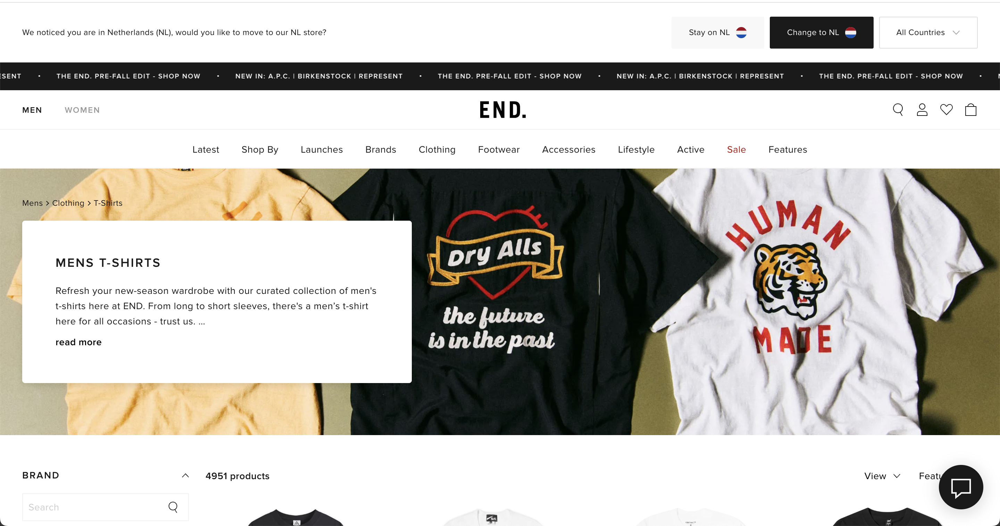
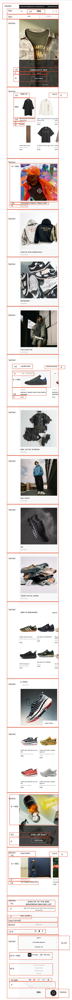
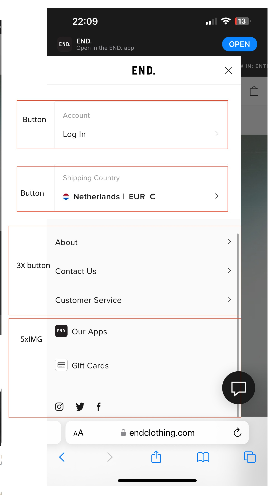

# Procesverslag

Markdown is een simpele manier om HTML te schrijven.  
Markdown cheat cheet: [Hulp bij het schrijven van Markdown](https://github.com/adam-p/markdown-here/wiki/Markdown-Cheatsheet).

Nb. De standaardstructuur en de spartaanse opmaak van de README.md zijn helemaal prima. Het gaat om de inhoud van je procesverslag. Besteedt de tijd voor pracht en praal aan je website.

Nb. Door _open_ toe te voegen aan een _details_ element kun je deze standaard open zetten. Fijn om dat steeds voor de relevante stuk(ken) te doen.

## Jij

  
uitwerken voor kick-off werkgroep

### Auteur:

    Mamush Hepark

#### Je startniveau:

Blauw

#### Je focus:

Surface plane

## Je website

  
uitwerken voor kick-off werkgroep

### Je opdracht:

link naar de website die je gaat namaken óf de naam/omschrijving van je eigen ontwerp
https://www.endclothing.com/nl

#### Screenshot(s) van de eerste pagina (small screen):

hier de naam van de pagina  
 

#### Screenshot(s) van de tweede pagina (small screen):

hier de naam van de pagina  
 

## Toegankelijkheidstest 1/2 (week 1)

  
uitwerken na test in 2e werkgroep

### Bevindingen

Toen ik de schokband om deed die Parkinson simuleert besefte ik me pas goed hoe erg je wordt gelimiteerd in je doen en laten als je dit hebt. Doordat je continu schokt en geen controle hebt over je spieren wordt het enorm lastig om alledaagse taken uit te voeren, laat staan een toetsenbord besturen. Typen lukte mij niet en het was erg frustrerend dat wat jij wil doen totaal niet lukt. Je klikt constant op verkeerde toetsen, verwijderd goede letters en klikt op verkeerde knoppen. Het is vrijwel onmogelijk om een gewone laptop te gebruiken.

Eventuele oplossingen:

-Speciale parkinson stand op je site met grotere knoppen
-eenvoudige en duidelijke navigatie
-toetsenbordnavigatie ondersteunen
-Verhoog de Verzendtijden voor Interactieve Elementen: Voor interactieve elementen zoals formulieren en knoppen, kun je een lichte vertraging in de actie inbouwen om per ongeluk klikken te voorkomen, waardoor gebruikers de tijd krijgen om hun actie te bevestigen.

## Breakdownschets (week 1)

  
uitwerken na afloop 3e werkgroep

### de hele pagina:

  

### dynamisch deel (bijv menu):

  

### wellicht nog een dynamisch deel (bijv filter):

  

## Voortgang 1 (week 2)

  
uitwerken voor 1e voortgang

### Stand van zaken

In ben ik vooral gaan oriënteren, hoe zit de site in elkaar en welke delen zullen een uitdaging zijn om na te maken.
Aan de hand van de breakdownschets heb ik vrij soepel mijn html op weten te zetten voor beide pagina's. Ook heb ik gekeken naar elementen in de site, zoals de slider, die een uitdaging zullen zijn in de toekomst.

### Agenda voor meeting

samen met je groepje opstellen

| student 1      | student 2          | student 3    | student 4        |
| -------------- | ------------------ | ------------ | ---------------- |
| dit bespreken  | en dit             | en ik dit    | en dan ik dat    |
| en dat ook nog | dit als er tijd is | nog een punt | dit wil ik zeker |
| ...            | ...                | ...          | ...              |

### Verslag van meeting

hier na afloop snel de uitkomsten van de meeting vastleggen

- html is in orde
- punt 2
- nog een punt
- ...

## Voortgang 2 (week 3)

  
uitwerken voor 2e voortgang

### Stand van zaken

redelijk op schema laatste styling afmaken en dan door naar surface plane. Sommige styling kan beter worden afgewerkt maar goed op weg. Er is een positief vooruitzicht en het is zeker nog haalbaar. Nu nog bedenken wat je gaat doen qua surface plane.

### Agenda voor meeting

samen met je groepje opstellen

| student 1      | student 2          | student 3    | student 4        |
| -------------- | ------------------ | ------------ | ---------------- |
| dit bespreken  | en dit             | en ik dit    | en dan ik dat    |
| en dat ook nog | dit als er tijd is | nog een punt | dit wil ik zeker |
| ...            | ...                | ...          | ...              |

### Verslag van meeting

hier na afloop snel de uitkomsten van de meeting vastleggen

- goed op weg en duidelijke antwoorden gekregen op de vragen
- nu lijstje maken van surface plane en nog even blokken
- ...

## Toegankelijkheidstest 2/2 (week 4)

  
uitwerken na test in 9e werkgroep

### Bevindingen

Lijst met je bevindingen die in de test naar voren kwamen (geef ook aan wat er verbeterd is):
nachtmodus is verbeterd, de site is beter te gebruiken met een screenreader en de altteksten zijn sterk verbeterd.

Door de test besef ik me dat mijn site sterk is verbeterd in toegankelijkheid in de loop van de opracht. Wel zijn er nog een aantal punten die missen zoals bijvoorbeeld de skiplink of het verhoogde contrast.

## Voortgang 3 (week 4)

  
uitwerken voor 3e voortgang

### Stand van zaken

De html en styling is nu goed af alleen nog surface plane. Hier loop ik nog tegen een aantal dingen aan die ik in de eindsprint zal afmaken. Naar mijn idee lig ik goed op schema.

### Agenda voor meeting

samen met je groepje opstellen

| student 1      | student 2          | student 3    | student 4        |
| -------------- | ------------------ | ------------ | ---------------- |
| dit bespreken  | en dit             | en ik dit    | en dan ik dat    |
| en dat ook nog | dit als er tijd is | nog een punt | dit wil ik zeker |
| ...            | ...                | ...          | ...              |

### Verslag van meeting

hier na afloop snel de uitkomsten van de meeting vastleggen

- nu duidelijk welke laatste surface plane elementen ik moet toevoegen en nu heb ik er ook goede bronnen bij.
- punt 2
- nog een punt
- ...

## Eindgesprek (week 5)

  
uitwerken voor eindgesprek

### Je uitkomst - karakteristiek screenshots:

  

### Dit ging goed/Heb ik geleerd:

De html ging vrij vloeiend echter was de styling vrij moeilijk. Ook het maken van de sliders en producten die wisselen van opacity vond ik lastig. Wat ik heb geleerd is het vinden van goede bronnen en hier zelf op doorwerken. Ook heb ik geleerd hoe je een effectieve slider kunt maken.

### Dit was lastig/Is niet gelukt:

Het maken van een twee bij twee slider is mij helaas niet gelukt.

  

## Bronnenlijst

  
continu bijhouden terwijl je werkt

Nb. Wees specifiek ('css-tricks' als bron is bijv. niet specifiek genoeg).
Nb. ChatGpT en andere AI horen er ook bij.
Nb. Vermeld de bronnen ook in je code.

1. bron 1 burgermenu https://codepen.io/g13nn/pen/eHGEF https://www.w3schools.com/howto/howto_js_mobile_navbar.asp
2. bron 2 email formulier https://www.w3schools.com/howto/howto_js_popup_form.asp
   https://developer.mozilla.org/en-US/docs/Web/CSS/:invalid
3. bron 3 slider https://www.w3schools.com/howto/howto_js_slideshow.asp

4. bron 4 lazy loading opacity https://codepen.io/malchata/pen/YeMyrQ

5. bron 5 size selection form https://www.w3schools.com/html/html_forms.asp?
   https://www.w3schools.com/js/js_validation.asp
6. bron 6 sticky footer https://developer.mozilla.org/en-US/docs/Web/CSS/Layout_cookbook/Sticky_footers

